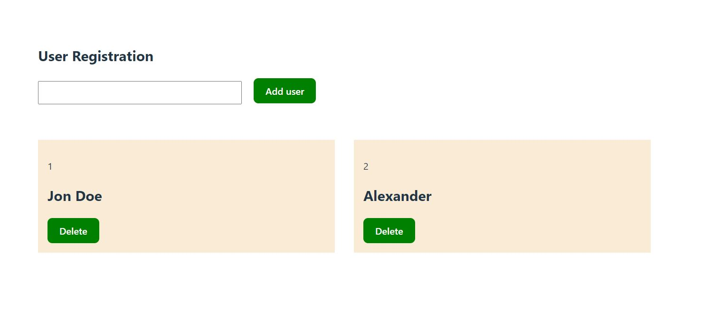

# Details about useContext, useReducer and stateLifting
<!-- ### It's a Full Mobile Responsive App -->

### Go to Live Project: https://usecontext-usereducer-statelifting.netlify.app/
<!--  -->
<!--  -->

